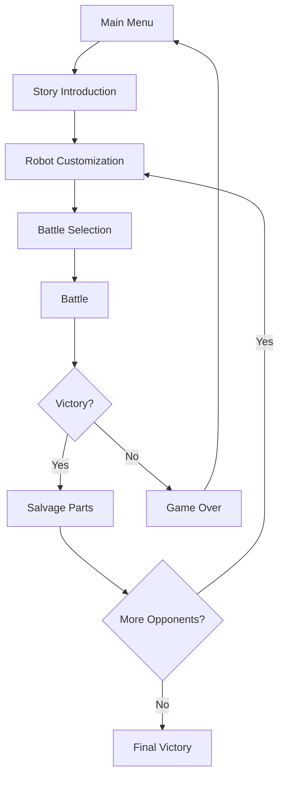

# Rustborn


A turn-based robot battle game set in an alien wasteland, developed in AutoHotkey v2.0 with Direct2D rendering.

## 🤖 Overview

Rustborn is a tactical RPG where you control a customizable robot in a post-apocalyptic alien environment. Battle against increasingly powerful opponents, salvage their parts to upgrade your robot, and uncover the secrets of the wasteland.


## ✨ Features

- **Turn-based Combat System**: Strategic battles with multiple action types
- **Robot Customization**: 7 different part slots with unique effects on your robot's capabilities
- **Part Salvaging**: Defeat opponents to claim their parts for your own use
- **Elemental Abilities**: Fire, Ice, Lightning, Acid, and Shadow elements with unique effects
- **Story Progression**: Battle through 4 unique opponents with increasing difficulty
- **Save/Load System**: Save your progress and continue your journey later

## 🎮 Controls

- **Space**: Confirm/Select
- **Escape**: Back/Menu
- **Arrow Keys**: Navigate menus and options
- **F5**: Save Game
- **F9**: Load Game

## 🛠️ Installation

### Prerequisites

- AutoHotkey v2.0 or later
- Windows OS

### Setup

1. Clone this repository:
   ```
   git clone https://github.com/yourusername/rustborn.git
   ```

2. Ensure you have AutoHotkey v2.0 installed
   - Download from [AutoHotkey Website](https://www.autohotkey.com/)

3. Run the game:
   - Double-click on `Game.ahk` or right-click and select "Run Script"

## 🎲 Game Mechanics

### Robot Parts

Each robot has 7 customizable parts:

| Part Type  | Primary Effects                        |
|------------|---------------------------------------|
| Head       | Accuracy, Critical Hit Chance         |
| Torso      | Health, Defense                       |
| Left Arm   | Attack, Special Abilities             |
| Right Arm  | Attack, Special Abilities             |
| Left Leg   | Evasion, Speed                        |
| Right Leg  | Evasion, Speed                        |
| Power Core | Energy Regeneration, Special Efficiency|

### Elemental Types

Parts can have elemental properties that grant special abilities:

- **🔥 Fire**: Damage over time effects
- **❄️ Ice**: Slowing/freezing effects
- **⚡ Lightning**: Critical hit chance and speed boosts
- **🧪 Acid**: Defense reduction effects
- **🌑 Shadow**: Evasion and stealth effects

### Battle System

Battles are turn-based with the following actions:

1. **Attack**: Basic damage based on your robot's attack stat
2. **Defend**: Reduce incoming damage for one turn
3. **Special**: Use elemental abilities (costs energy)
4. **Item**: Use items from your inventory (future implementation)

## 🔄 Game Flow



## 🧰 Technologies Used

- **AutoHotkey v2.0**: Core programming language
- **Direct2D**: Graphics rendering via D2D1.ahk library
- **Object-Oriented Design**: Class-based architecture for game components


## 🚧 Development Status

Rustborn is currently in active development with a functional prototype. Here's the current status:

### Implemented Features
- ✅ Core game loop and state management
- ✅ Robot class with customizable parts
- ✅ Basic battle system with turn-based combat
- ✅ Four unique opponents with different strategies
- ✅ Special abilities based on elemental types
- ✅ Part salvaging system
- ✅ Direct2D rendering for UI and game elements
- ✅ Debug logging system

### In Progress
- 🔄 Save/load functionality (structure defined but not fully implemented)
- 🔄 Battle animations and visual effects
- 🔄 Robot customization interface refinement
- 🔄 Balance adjustments for combat and progression

### Planned Features
- 📋 Item system for consumables and battle aids
- 📋 Enhanced visual representations of robots and parts
- 📋 Sound effects and background music
- 📋 Expanded story elements and dialogue
- 📋 Additional opponents and part varieties
- 📋 More special abilities for each elemental type
- 📋 Visual effects for abilities and actions
- 📋 Tutorial system for new players
- 📋 Statistics tracking for battles and gameplay
- 📋 Achievement system

### Known Issues
- ⚠️ Some battle actions may not properly update the UI
- ⚠️ Energy regeneration balance needs adjustment
- ⚠️ Special ability menu navigation can be improved
- ⚠️ Window resizing can cause rendering issues

See the [RobotBattleGamePlan.md](RobotBattleGamePlan.md) for the detailed implementation roadmap and technical planning.

## 👥 Credits

- **Developer**: CasperHarkin
- **Direct2D Library**: D2D1.ahk

## 📄 License

This project is licensed under the MIT License - see the LICENSE file for details.

---

*"In the wasteland, only the strongest robots survive. Will yours be among them?"*