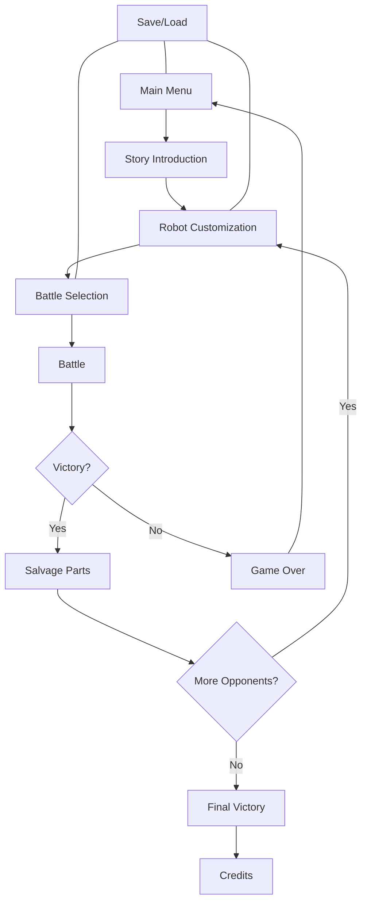
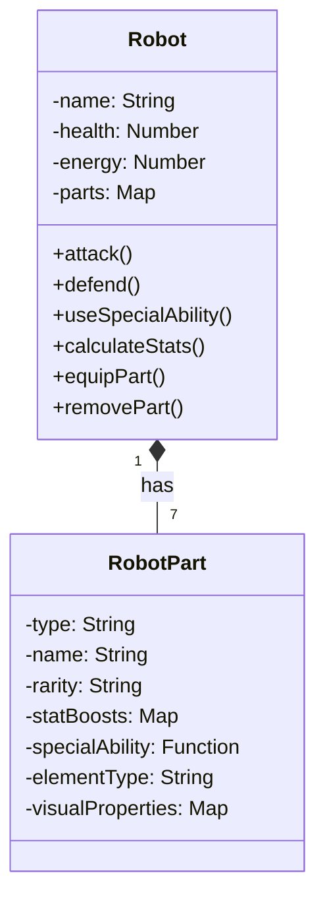
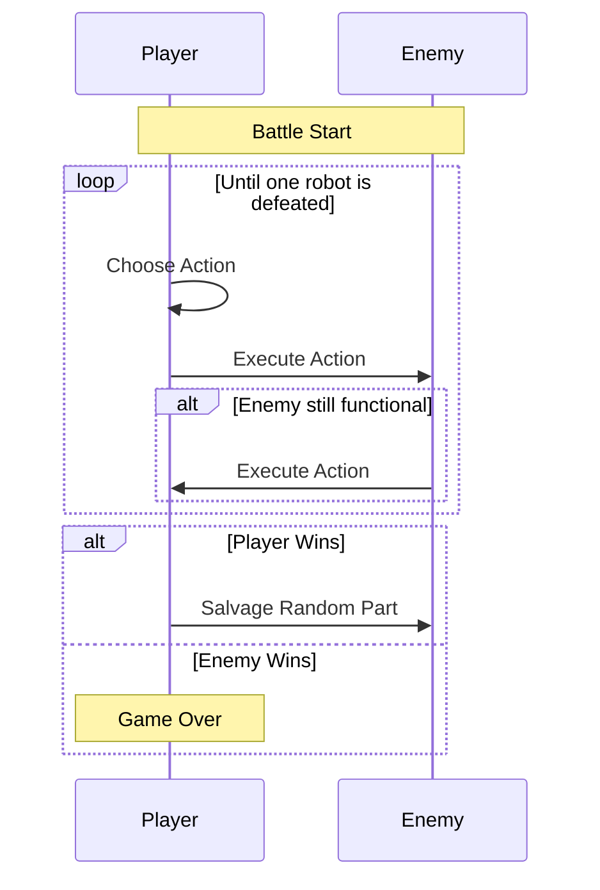
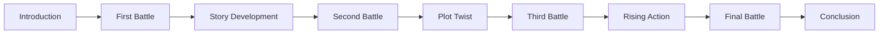
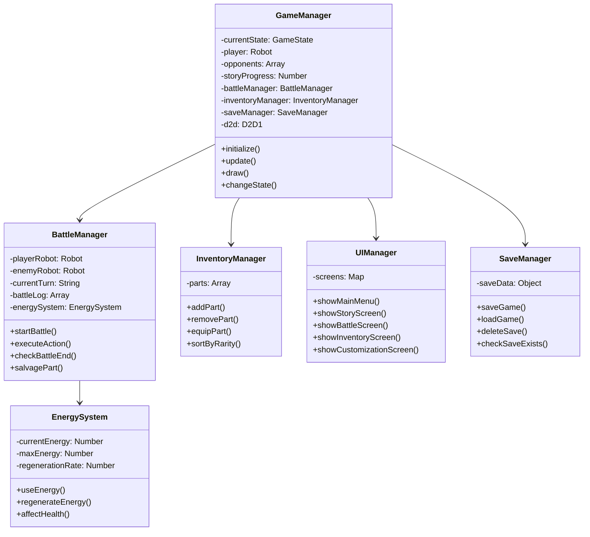
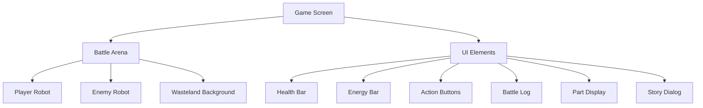
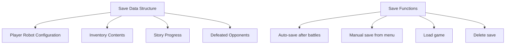
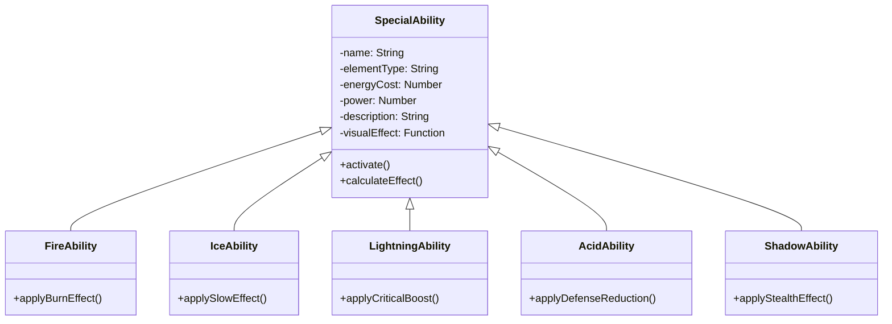

# Rustborn - Robot Battle Game - Detailed Plan

## Game Concept

A turn-based robot battle game where players customize their robot with parts salvaged from defeated opponents. Set in an alien wasteland with a story element, robots fight in 1v1 battles with the winner claiming a random part from the loser based on a tiered rarity system.

## Core Game Components

### 1. Robot Structure

**Robot Parts:**
- Head: Affects accuracy and critical hit chance
- Arms (Left/Right): Affect attack power and special abilities
- Legs (Left/Right): Affect evasion and movement speed
- Torso: Affects health and defense
- Power Core: Affects energy regeneration and special ability power

**Part Rarities:**
- Poor (Common): Basic stats, no special abilities
- Good (Uncommon): Better stats, minor special abilities
- Epic (Rare): Best stats, powerful special abilities

**Elemental Types for Special Abilities:**
- Fire: Damage over time effects
- Ice: Slowing/freezing effects
- Lightning: Critical hit chance and speed boosts
- Acid: Defense reduction effects
- Shadow: Evasion and stealth effects

### 2. Battle System

**Battle Actions:**
1. **Attack**: Basic damage based on arm parts
2. **Defend**: Reduce incoming damage for one turn
3. **Special Ability**: Elemental effects based on equipped parts (costs energy)

**Energy Management:**
- Energy is consumed when using special abilities
- Energy regenerates slightly each turn
- Low energy affects health regeneration
- Power core part affects energy efficiency

**Battle Flow:**
1. Player selects action
2. Action is executed with animations and effects
3. Energy is consumed/regenerated
4. Enemy selects and executes action
5. Repeat until one robot is defeated
6. Winner salvages a part from the loser

### 3. Story Elements

- Simple narrative about survival in an alien wasteland
- Each opponent robot has a backstory and motivation
- Progressive revelation of the wasteland's origin
- Final opponent reveals a major plot point
- Open ending for potential sequel/expansion

### 4. Opponent Robots (4 Total)

1. **Scavenger**: Balanced stats, focuses on resource efficiency
   - Special: Acid-based abilities that corrode defenses
   - Backstory: Former maintenance robot repurposed for survival

2. **Guardian**: High defense, low speed
   - Special: Ice-based abilities that slow opponents
   - Backstory: Security robot protecting abandoned alien facility

3. **Hunter**: High speed, low defense
   - Special: Lightning-based abilities for quick strikes
   - Backstory: Reconnaissance unit that developed predatory behavior

4. **Final Boss - Overlord**: High stats in all categories
   - Special: Shadow-based abilities with unpredictable effects
   - Backstory: Master control unit that orchestrated the wasteland's current state

### 5. Technical Architecture

## Implementation Plan & Status

### Phase 1: Core Framework
- ✅ Set up basic game structure with Direct2D
- ✅ Implement game state management
- ✅ Create basic UI screens
- ✅ Implement robot and part classes
- 🔄 Create save/load system (structure defined but not fully implemented)

### Phase 2: Battle System
- ✅ Implement turn-based battle mechanics
- ✅ Create basic attack and defend actions
- ✅ Implement health and damage calculations
- ✅ Add energy management system
- ✅ Add battle UI elements

### Phase 3: Robot Parts & Customization
- ✅ Implement part system with different rarities
- ✅ Create part equipping/unequipping functionality
- ✅ Implement stat calculations based on parts
- 🔄 Create inventory management system (basic implementation)
- ✅ Add elemental types and effects

### Phase 4: Story & Opponents
- ✅ Create the 4 opponent robots with unique parts
- 🔄 Implement story screens and dialogue (basic implementation)
- ✅ Create progression through opponents
- ✅ Add special abilities for each elemental type
- ✅ Implement final boss battle

### Phase 5: Polish & Content (Planned)
- 📋 Add alien wasteland visual theme
- 📋 Implement sound effects and music
- 🔄 Balance gameplay and difficulty
- 📋 Add visual effects for abilities
- 📋 Final testing and bug fixes

### Known Issues
- ⚠️ Some battle actions may not properly update the UI
- ⚠️ Energy regeneration balance needs adjustment
- ⚠️ Special ability menu navigation can be improved
- ⚠️ Window resizing can cause rendering issues
- ⚠️ Defend action implementation is incomplete
- ⚠️ Item action is a placeholder with no functionality

## Visual Design

**Robot Visualization:**
- Modular design showing all equipped parts
- Visual differences based on part rarity
- Elemental effects for special abilities
- Damage indicators and animations

**UI Elements:**
- Health and energy bars for both robots
- Action buttons for player choices
- Battle log showing recent actions
- Current equipped parts display
- Story dialogue boxes

**Alien Wasteland Theme:**
- Desolate landscape with alien elements
- Strange vegetation and rock formations
- Distant alien structures
- Atmospheric lighting effects

## Save/Load System

- Save data stored in JSON format
- Auto-save feature after each battle
- Manual save option from the main menu
- Multiple save slots (3)
- Save data includes:
  * Player robot configuration
  * Inventory of collected parts
  * Story progress
  * Battle statistics

## Special Abilities System

**Fire Abilities:**
- Flame Burst: Direct damage + burn effect
- Heat Shield: Temporary defense boost
- Overheat: High damage but damages self

**Ice Abilities:**
- Frost Beam: Moderate damage + slow effect
- Ice Armor: Defense boost + energy regeneration
- Cryo Lock: Freeze opponent for one turn

**Lightning Abilities:**
- Shock Strike: Quick attack with critical chance
- Surge: Speed boost for multiple turns
- EMP Blast: Disables opponent's special abilities

**Acid Abilities:**
- Corrosive Spray: Reduces opponent's defense
- Dissolve: Continuous damage over time
- Acid Shield: Damages attackers on contact

**Shadow Abilities:**
- Phantom Strike: Attack with chance to evade counter
- Void Shield: Absorbs damage and converts to energy
- Eclipse: Temporarily disables opponent's vision

## Energy Management

- Energy is a resource used for special abilities
- Each robot has a maximum energy capacity based on power core
- Energy regenerates each turn at a rate determined by parts
- Low energy levels affect health regeneration
- Some parts provide energy bonuses or reduce ability costs
- Strategic energy management is key to victory

## Technical Considerations

1. **Direct2D Implementation:**
   - Use D2D1.ahk for rendering
   - Implement animation system for robot movements
   - Create event system for battle actions
   - Optimize for smooth performance

2. **Game State Management:**
   - Main menu state
   - Story state
   - Customization state
   - Battle selection state
   - Battle state
   - Inventory state

3. **Data Structure:**
   - JSON format for storing part data and save files
   - Structured robot and part classes
   - Battle log system for tracking actions

4. **Random Generation:**
   - Weighted random system for part drops based on rarity
   - Varied opponent configurations
   - Random special ability effects