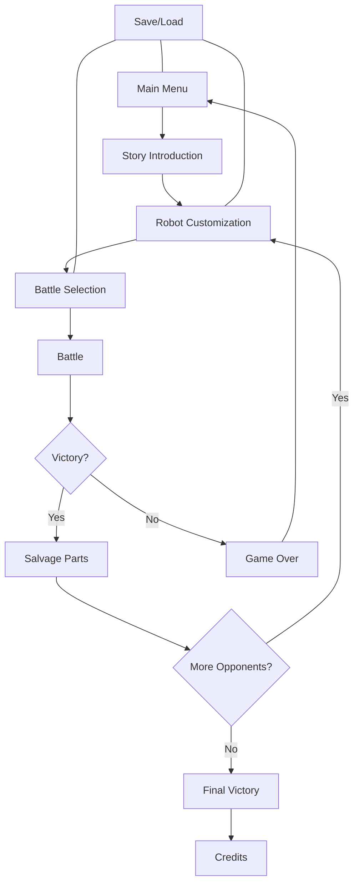
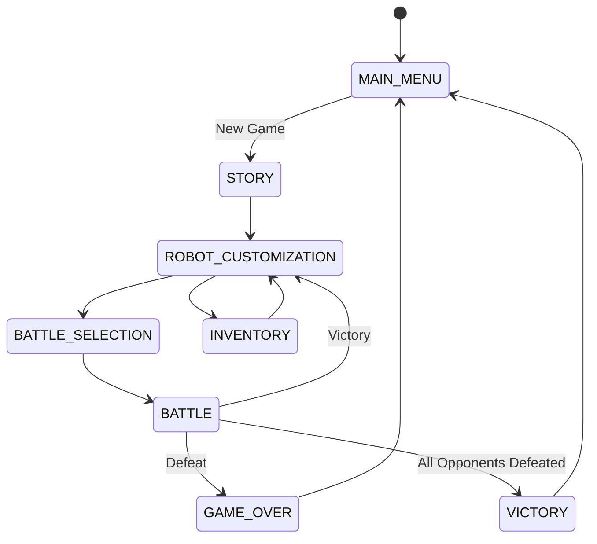
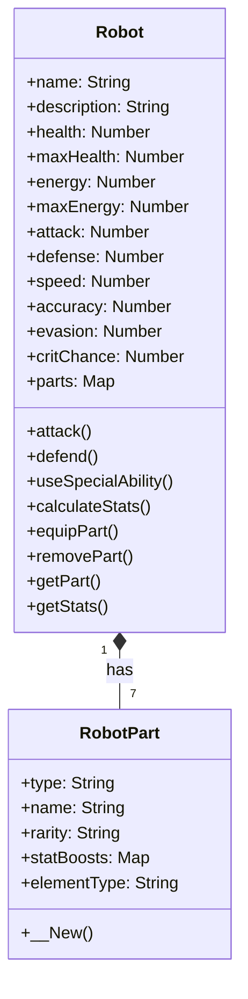
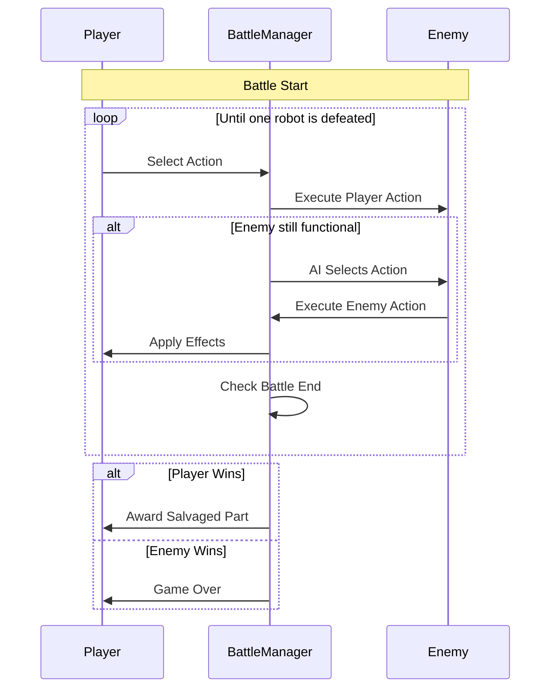

# Rustborn: Robot Battle Game - Technical Breakdown

## Overview

Rustborn is a turn-based robot battle game set in an alien wasteland, developed in AutoHotkey v2.0 using the Direct2D library for rendering. Players customize their robot with parts salvaged from defeated opponents, progressing through a story while battling increasingly difficult enemies.

## Game Architecture

The game is structured around several key components that work together to create a cohesive experience:

### 1. Core Files

- **Game.ahk**: Main game file containing the game loop, state management, and UI rendering
- **Robot.ahk**: Defines the Robot and RobotPart classes for player and enemy robots
- **BattleManager.ahk**: Handles battle mechanics, turn management, and action execution
- **Debug.ahk**: Provides logging functionality for debugging and tracking game events

### 2. Game States

The game uses a state machine pattern to manage different screens and gameplay phases:

- **MAIN_MENU**: Entry point with options for New Game, Load Game, and Exit
- **STORY**: Narrative screens that advance the plot
- **ROBOT_CUSTOMIZATION**: Interface for equipping and modifying robot parts
- **BATTLE_SELECTION**: Screen showing information about the next opponent
- **BATTLE**: The core gameplay screen where turn-based combat occurs
- **INVENTORY**: Management of collected robot parts
- **GAME_OVER**: Displayed when the player is defeated
- **VICTORY**: Displayed when all opponents are defeated

## Robot System

### Robot Structure

### Robot Parts

Each robot has 7 part slots that affect different aspects of performance:

1. **Head**: Affects accuracy and critical hit chance
2. **Torso**: Affects health and defense
3. **Left Arm**: Affects attack power and special abilities
4. **Right Arm**: Affects attack power and special abilities
5. **Left Leg**: Affects evasion and movement speed
6. **Right Leg**: Affects evasion and movement speed
7. **Power Core**: Affects energy regeneration and special ability efficiency

### Part Rarities

Parts come in three rarity levels that determine their effectiveness:

1. **Poor (Common)**: Basic stats, no elemental effects
2. **Good (Uncommon)**: Better stats, minor elemental effects
3. **Epic (Rare)**: Best stats, powerful elemental effects

### Elemental Types

Parts can have one of five elemental types that grant special abilities:

1. **Fire**: Damage over time effects
2. **Ice**: Slowing/freezing effects
3. **Lightning**: Critical hit chance and speed boosts
4. **Acid**: Defense reduction effects
5. **Shadow**: Evasion and stealth effects

### Stat System

Robots have several stats that determine their combat effectiveness:

- **Health**: Hit points, reduced by damage
- **Energy**: Resource for special abilities
- **Attack**: Base damage output
- **Defense**: Damage reduction
- **Speed**: Turn order and evasion chance
- **Accuracy**: Chance to hit opponent
- **Evasion**: Chance to avoid attacks
- **Critical Chance**: Probability of dealing extra damage

Stats are calculated based on the combined effects of all equipped parts.

## Battle System

### Battle Flow

### Battle Actions

1. **Attack**: Basic damage based on attack stat
   - Hit chance based on accuracy vs. evasion
   - Critical hits deal 50% more damage
   - Damage reduced by opponent's defense

2. **Defend**: Reduces incoming damage by 50% for one turn

3. **Special**: Elemental abilities with unique effects
   - Costs energy to use
   - Effects vary based on the element type
   - More powerful than basic attacks

4. **Item**: Placeholder for future implementation

### Special Abilities

Each elemental type provides unique special abilities:

- **Fire (Flame Burst)**: 20% more damage + burn effect
- **Ice (Frost Beam)**: Reduces enemy speed by 30%
- **Lightning (Shock Strike)**: 40% critical chance, double damage on crit
- **Acid (Corrosive Spray)**: Reduces enemy defense by 20%
- **Shadow (Phantom Strike)**: Grants evasion for next attack

### Energy System

- Energy is consumed when using special abilities
- Energy regenerates each turn (base + 5% of max)
- Power core affects maximum energy and regeneration rate
- Strategic energy management is crucial for battle success

## Opponents

The game features four progressively challenging opponents:

### 1. Scavenger
- **Description**: Former maintenance robot repurposed for survival
- **Specialty**: Acid-based abilities that corrode defenses
- **Parts**: Mostly "good" quality with acid elemental type
- **Strategy**: Balanced stats with focus on defense reduction

### 2. Guardian
- **Description**: Security robot protecting abandoned alien facility
- **Specialty**: Ice-based abilities that slow opponents
- **Parts**: Mix of "good" and "epic" quality with ice elemental type
- **Strategy**: High defense, focuses on slowing player and tanking damage

### 3. Hunter
- **Description**: Reconnaissance unit that developed predatory behavior
- **Specialty**: Lightning-based abilities for quick strikes
- **Parts**: Mostly "epic" quality with lightning elemental type
- **Strategy**: High speed and accuracy, focuses on critical hits

### 4. Overlord (Final Boss)
- **Description**: Master control unit that orchestrated the wasteland's current state
- **Specialty**: Shadow-based abilities with unpredictable effects
- **Parts**: All "epic" quality with shadow elemental type
- **Strategy**: High stats in all categories, powerful special abilities

## Technical Implementation

### Direct2D Rendering

The game uses the D2D1.ahk library for rendering graphics:

- Creates a GUI window with the game canvas
- Renders robot representations, UI elements, and battle effects
- Manages animation frames and timing
- Handles screen transitions between game states

### Event System

An event-driven architecture manages game events:

- State changes trigger appropriate handlers
- Battle events (start, end, actions) update the game state
- Robot events (part equipped, part removed) recalculate stats
- Story events track progression through the narrative

### Debug System

A comprehensive logging system tracks game events:

- Categorized log entries (INFO, WARN, ERROR, SUCCESS, STATE, BATTLE, ROBOT, EVENT)
- Timestamp for each entry
- Prevention of duplicate message spam
- Formatted markdown output to Log.txt

### Input Handling

User input is managed through hotkeys:

- Space: Confirm/Select
- Escape: Back/Menu
- Arrow Keys: Navigate
- F5: Save Game
- F9: Load Game

## Game Loop

The main game loop runs at approximately 60 FPS:

1. Calculate frame time and FPS
2. Update game state based on current state
3. Draw the appropriate screen for the current state
4. Process user input through event handlers
5. Repeat

## Development Status

### Implemented Features
- ✅ Core game architecture and state management system
- ✅ Robot class with customizable parts and stat calculations
- ✅ Battle system with turn-based combat mechanics
- ✅ Four unique opponents with different elemental specialties
- ✅ Special abilities based on five elemental types
- ✅ Part salvaging system for progression
- ✅ Direct2D rendering for UI and game elements
- ✅ Debug logging system with categorized entries

### In Progress
- 🔄 Save/load functionality (structure defined but not fully implemented)
- 🔄 Battle animations and visual effects
- 🔄 Robot customization interface refinement
- 🔄 Balance adjustments for combat and progression

### Planned Features
- 📋 Item system for consumable battle aids
- 📋 Additional opponents with unique abilities and parts
- 📋 Enhanced robot visualizations and battle effects
- 📋 Sound effects and background music
- 📋 Expanded story elements and character development
- 📋 More special abilities for each elemental type
- 📋 Visual effects for abilities and actions
- 📋 Tutorial system for new players
- 📋 Statistics tracking for battles and gameplay
- 📋 Achievement system
- 📋 Multiplayer: PvP battles between customized robots (long-term)

### Known Issues
- ⚠️ Some battle actions may not properly update the UI
- ⚠️ Energy regeneration balance needs adjustment
- ⚠️ Special ability menu navigation can be improved
- ⚠️ Window resizing can cause rendering issues
- ⚠️ Defend action implementation is incomplete
- ⚠️ Item action is a placeholder with no functionality

## Conclusion

Rustborn is a well-structured turn-based RPG with a unique robot customization system. The modular architecture allows for easy expansion and modification, while the battle system provides strategic depth through the interplay of robot parts, elemental abilities, and resource management.

The game demonstrates effective use of AutoHotkey v2.0 for game development, leveraging the Direct2D library for rendering and implementing complex game mechanics through object-oriented programming.